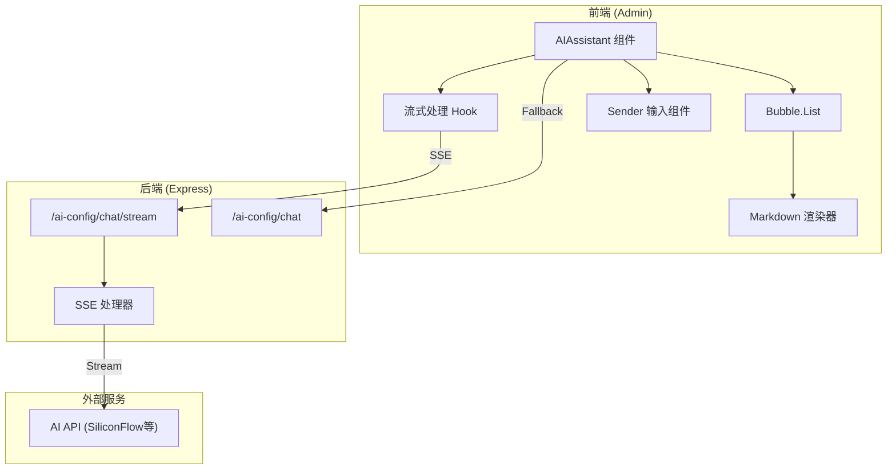
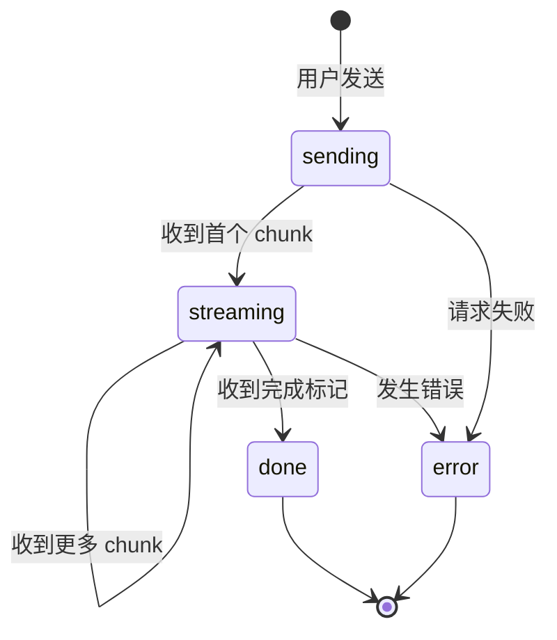

# Design Document: AI Assistant Enhancement

## Overview

本设计文档描述管理后台 AI 助手组件的增强方案，包括流式输出、Markdown 渲染和界面优化。采用 Ant Design X 组件库和 `@ant-design/x-markdown` 实现现代化的 AI 对话体验。

## Architecture



## Components and Interfaces

### 1. AIAssistant 组件 (增强版)

```typescript
interface AIAssistantProps {
  title?: string;
  placeholder?: string;
  systemContext?: string;
  visible?: boolean;
  onClose?: () => void;
  floating?: boolean;
  style?: React.CSSProperties;
  // 新增属性
  enableStreaming?: boolean;      // 是否启用流式输出
  quickPrompts?: QuickPrompt[];   // 快捷提问列表
  theme?: 'light' | 'dark';       // 主题
}

interface QuickPrompt {
  label: string;
  prompt: string;
  icon?: React.ReactNode;
}

interface Message {
  key: string;
  role: 'user' | 'assistant';
  content: string;
  timestamp: number;
  status?: 'sending' | 'streaming' | 'done' | 'error';
}
```

### 2. useStreamChat Hook

```typescript
interface UseStreamChatOptions {
  apiUrl: string;
  systemContext?: string;
  onError?: (error: Error) => void;
}

interface UseStreamChatReturn {
  messages: Message[];
  isStreaming: boolean;
  sendMessage: (content: string) => Promise<void>;
  cancelStream: () => void;
  clearMessages: () => void;
}

function useStreamChat(options: UseStreamChatOptions): UseStreamChatReturn;
```

### 3. 后端流式 API

```typescript
// POST /api/ai-config/chat/stream
// Request Body
interface StreamChatRequest {
  message: string;
  context?: Array<{ role: string; content: string }>;
}

// Response: SSE Stream
// event: message
// data: {"content": "部分内容", "done": false}
// ...
// event: message  
// data: {"content": "", "done": true}
// 或
// event: error
// data: {"error": "错误信息"}
```

## Data Models

### Message 状态机



### SSE 事件格式

```typescript
// 正常消息事件
interface SSEMessageEvent {
  event: 'message';
  data: {
    content: string;  // 本次返回的内容片段
    done: boolean;    // 是否完成
  };
}

// 错误事件
interface SSEErrorEvent {
  event: 'error';
  data: {
    error: string;
  };
}
```

## Correctness Properties

*A property is a characteristic or behavior that should hold true across all valid executions of a system—essentially, a formal statement about what the system should do. Properties serve as the bridge between human-readable specifications and machine-verifiable correctness guarantees.*

### Property 1: 流式内容累积正确性

*For any* 流式响应序列，将所有 chunk 的 content 按顺序拼接后，应该等于完整的 AI 回复内容。

**Validates: Requirements 1.2, 4.3**

### Property 2: SSE 响应头正确性

*For any* 流式 API 请求，响应头必须包含 `Content-Type: text/event-stream` 和 `Cache-Control: no-cache`。

**Validates: Requirements 4.2**

### Property 3: Markdown 语法渲染完整性

*For any* 包含标准 Markdown 语法（标题、列表、链接、代码块、表格、引用）的内容，渲染后的 HTML 应包含对应的语义化标签。

**Validates: Requirements 2.1, 2.5**

### Property 4: 消息时间戳存在性

*For any* 消息对象，必须包含有效的 timestamp 字段，且该时间戳应在消息创建时设置。

**Validates: Requirements 3.2**

## Error Handling

### 前端错误处理

| 错误场景 | 处理方式 |
|---------|---------|
| 网络连接失败 | 显示错误提示，提供重试按钮 |
| 流式传输中断 | 保留已接收内容，标记为错误状态 |
| SSE 解析失败 | 记录日志，尝试继续处理后续事件 |
| AI 服务不可用 | 降级到非流式 API |

### 后端错误处理

| 错误场景 | 处理方式 |
|---------|---------|
| AI 配置不存在 | 返回 400 错误，提示配置 AI |
| AI API 调用失败 | 发送 error 事件，关闭连接 |
| 请求参数无效 | 返回 400 错误，说明参数问题 |

## Testing Strategy

### 单元测试

- `useStreamChat` Hook 的状态管理逻辑
- SSE 事件解析函数
- Markdown 渲染组件的输出

### 属性测试

使用 fast-check 进行属性测试：

1. **流式内容累积测试**: 生成随机字符串序列，验证拼接结果
2. **SSE 响应头测试**: 验证所有流式请求的响应头
3. **Markdown 渲染测试**: 生成各种 Markdown 语法组合，验证渲染结果
4. **时间戳测试**: 验证所有消息都有有效时间戳

### 集成测试

- 完整的流式对话流程
- 错误场景的降级处理
- 主题切换功能

## Implementation Notes

### 依赖安装

```bash
# 前端
cd admin
npm install @ant-design/x-markdown

# 后端无需额外依赖，使用原生 SSE
```

### 关键实现点

1. **SSE 连接管理**: 使用 `EventSource` API 或 `fetch` + `ReadableStream`
2. **流式渲染优化**: 使用 `requestAnimationFrame` 批量更新 DOM
3. **Markdown 渲染**: 使用 `@ant-design/x-markdown` 的 `Markdown` 组件
4. **主题适配**: 通过 CSS 变量和 Ant Design 的 ConfigProvider 实现
