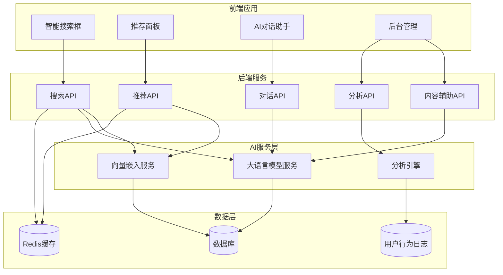
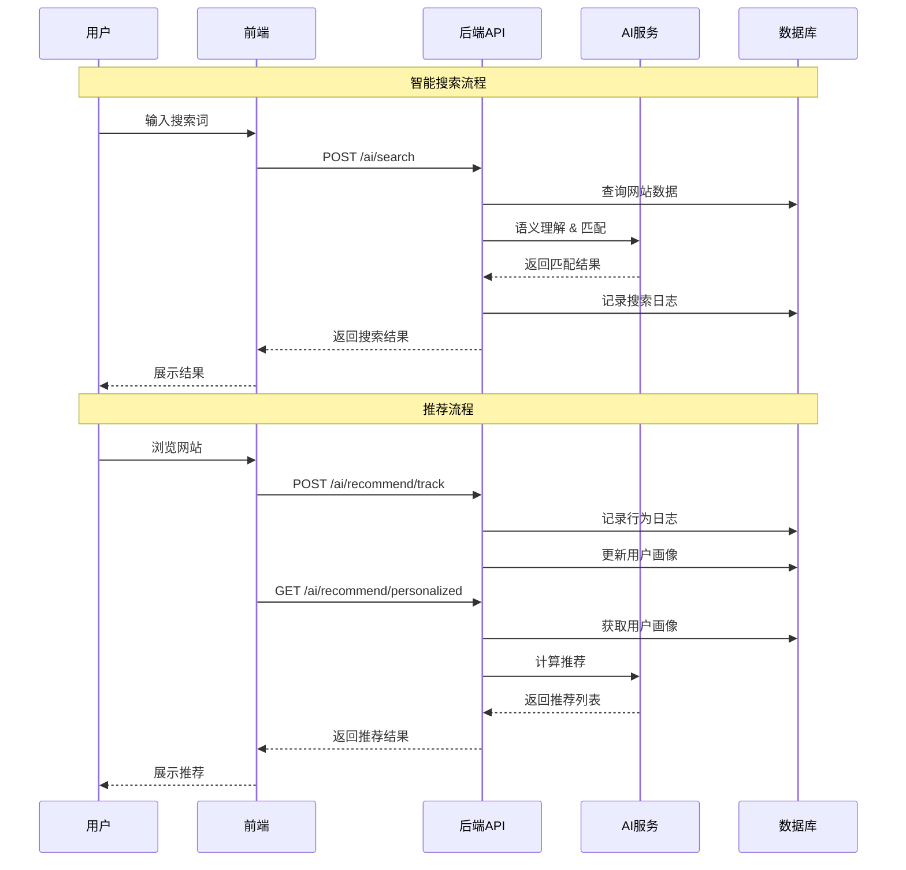

# Design Document: AI Full Integration

## Overview

本设计文档描述了设计导航系统全面AI功能集成的技术架构和实现方案。系统将集成四大AI功能模块：智能搜索、个性化推荐、用户行为分析和后台内容辅助。

技术栈：
- 前端：React + TypeScript + Ant Design
- 后端：Node.js + Express + Prisma
- AI服务：SiliconFlow API（支持多种开源模型）
- 数据库：SQLite（开发）/ MySQL（生产）

## Architecture



## Components and Interfaces

### 1. AI智能搜索模块

#### 1.1 搜索服务接口

```typescript
// backend/src/services/aiSearchService.ts

interface SearchQuery {
  query: string;           // 用户搜索词
  categoryId?: string;     // 可选的分类过滤
  limit?: number;          // 返回数量限制
  userId?: string;         // 用户ID（用于个性化）
}

interface SearchResult {
  id: string;
  name: string;
  description: string;
  url: string;
  iconUrl?: string;
  score: number;           // 相关度分数
  matchReason: string;     // 匹配原因说明
  category: {
    id: string;
    name: string;
  };
}

interface SearchResponse {
  results: SearchResult[];
  suggestions: string[];   // 搜索建议
  relatedQueries: string[]; // 相关搜索
  mode: 'semantic' | 'keyword' | 'hybrid';
  totalCount: number;
}

interface AISearchService {
  // 执行智能搜索
  search(query: SearchQuery): Promise<SearchResponse>;
  
  // 获取搜索建议（自动补全）
  getSuggestions(prefix: string, limit?: number): Promise<string[]>;
  
  // 获取热门搜索词
  getHotSearches(limit?: number): Promise<string[]>;
  
  // 记录搜索行为
  logSearch(query: string, userId?: string, resultCount: number): Promise<void>;
}
```

#### 1.2 搜索API端点

```typescript
// POST /api/ai/search
// 智能搜索
Request: {
  query: string;
  categoryId?: string;
  limit?: number;
}
Response: SearchResponse

// GET /api/ai/search/suggestions?q=xxx
// 搜索建议
Response: { suggestions: string[] }

// GET /api/ai/search/hot
// 热门搜索
Response: { hotSearches: string[] }
```

### 2. AI推荐系统模块

#### 2.1 推荐服务接口

```typescript
// backend/src/services/recommendService.ts

interface UserProfile {
  userId: string;
  viewedWebsites: string[];      // 浏览过的网站ID
  favoriteCategories: string[];  // 偏好分类
  searchHistory: string[];       // 搜索历史
  lastActiveAt: Date;
}

interface RecommendationItem {
  website: Website;
  score: number;
  reason: string;  // 推荐理由
  type: 'similar' | 'trending' | 'personalized' | 'new';
}

interface RecommendService {
  // 获取个性化推荐
  getPersonalizedRecommendations(
    userId: string, 
    limit?: number
  ): Promise<RecommendationItem[]>;
  
  // 获取相似工具推荐
  getSimilarWebsites(
    websiteId: string, 
    limit?: number
  ): Promise<RecommendationItem[]>;
  
  // 获取热门推荐
  getTrendingWebsites(
    categoryId?: string, 
    limit?: number
  ): Promise<RecommendationItem[]>;
  
  // 记录用户行为
  trackUserBehavior(
    userId: string, 
    action: 'view' | 'click' | 'favorite',
    websiteId: string
  ): Promise<void>;
  
  // 更新用户画像
  updateUserProfile(userId: string): Promise<UserProfile>;
}
```

#### 2.2 推荐API端点

```typescript
// GET /api/ai/recommend/personalized
// 个性化推荐
Response: { recommendations: RecommendationItem[] }

// GET /api/ai/recommend/similar/:websiteId
// 相似工具推荐
Response: { recommendations: RecommendationItem[] }

// GET /api/ai/recommend/trending
// 热门趋势推荐
Response: { recommendations: RecommendationItem[] }

// POST /api/ai/recommend/track
// 记录用户行为
Request: { action: string; websiteId: string }
```

### 3. AI分析模块

#### 3.1 分析服务接口

```typescript
// backend/src/services/analyticsService.ts

interface SearchAnalytics {
  topSearches: Array<{ query: string; count: number }>;
  searchTrends: Array<{ date: string; count: number }>;
  noResultQueries: string[];  // 无结果的搜索词
}

interface WebsiteAnalytics {
  topWebsites: Array<{ website: Website; clicks: number }>;
  trendingWebsites: Array<{ website: Website; growthRate: number }>;
  categoryDistribution: Array<{ category: string; count: number }>;
}

interface UserAnalytics {
  activeUsers: number;
  newUsers: number;
  userRetention: number;
  avgSessionDuration: number;
  topUserPaths: string[][];  // 用户浏览路径
}

interface AIInsight {
  type: 'suggestion' | 'warning' | 'trend';
  title: string;
  description: string;
  actionable: boolean;
  action?: string;
}

interface AnalyticsService {
  // 获取搜索分析
  getSearchAnalytics(
    startDate: Date, 
    endDate: Date
  ): Promise<SearchAnalytics>;
  
  // 获取网站分析
  getWebsiteAnalytics(
    startDate: Date, 
    endDate: Date
  ): Promise<WebsiteAnalytics>;
  
  // 获取用户分析
  getUserAnalytics(
    startDate: Date, 
    endDate: Date
  ): Promise<UserAnalytics>;
  
  // 获取AI洞察建议
  getAIInsights(): Promise<AIInsight[]>;
  
  // 生成分析报告
  generateReport(
    type: 'daily' | 'weekly' | 'monthly'
  ): Promise<string>;  // 返回报告URL
}
```

#### 3.2 分析API端点

```typescript
// GET /api/ai/analytics/search?start=xxx&end=xxx
// 搜索分析
Response: SearchAnalytics

// GET /api/ai/analytics/websites?start=xxx&end=xxx
// 网站分析
Response: WebsiteAnalytics

// GET /api/ai/analytics/users?start=xxx&end=xxx
// 用户分析
Response: UserAnalytics

// GET /api/ai/analytics/insights
// AI洞察
Response: { insights: AIInsight[] }

// POST /api/ai/analytics/report
// 生成报告
Request: { type: 'daily' | 'weekly' | 'monthly' }
Response: { reportUrl: string }
```

### 4. AI内容辅助模块

#### 4.1 内容辅助服务接口

```typescript
// backend/src/services/contentAssistantService.ts

interface WebsiteInfo {
  name: string;
  description: string;
  tags: string[];
  suggestedCategory?: string;
  iconUrl?: string;
}

interface ContentSuggestion {
  field: string;
  original: string;
  suggested: string;
  reason: string;
}

interface DuplicateCheck {
  isDuplicate: boolean;
  similarWebsites: Array<{
    website: Website;
    similarity: number;
  }>;
}

interface ContentAssistantService {
  // 根据URL生成网站信息
  generateWebsiteInfo(url: string): Promise<WebsiteInfo>;
  
  // 优化内容建议
  suggestContentImprovements(
    websiteId: string
  ): Promise<ContentSuggestion[]>;
  
  // 批量生成描述
  batchGenerateDescriptions(
    websiteIds: string[]
  ): Promise<Map<string, string>>;
  
  // 检查重复
  checkDuplicate(url: string): Promise<DuplicateCheck>;
  
  // 翻译内容
  translateContent(
    content: string, 
    targetLang: 'zh' | 'en'
  ): Promise<string>;
  
  // 检查链接有效性
  checkLinkValidity(url: string): Promise<{
    valid: boolean;
    statusCode?: number;
    alternativeUrl?: string;
  }>;
  
  // 自动分类
  suggestCategory(
    name: string, 
    description: string
  ): Promise<string>;
}
```

#### 4.2 内容辅助API端点

```typescript
// POST /api/ai/content/generate
// 生成网站信息
Request: { url: string }
Response: WebsiteInfo

// POST /api/ai/content/improve
// 内容优化建议
Request: { websiteId: string }
Response: { suggestions: ContentSuggestion[] }

// POST /api/ai/content/batch-generate
// 批量生成
Request: { websiteIds: string[] }
Response: { results: Map<string, string> }

// POST /api/ai/content/check-duplicate
// 重复检查
Request: { url: string }
Response: DuplicateCheck

// POST /api/ai/content/translate
// 翻译
Request: { content: string; targetLang: string }
Response: { translated: string }

// POST /api/ai/content/check-link
// 链接检查
Request: { url: string }
Response: { valid: boolean; statusCode?: number }

// POST /api/ai/content/suggest-category
// 分类建议
Request: { name: string; description: string }
Response: { categoryId: string; categoryName: string }
```

### 5. 前端组件设计

#### 5.1 智能搜索组件

```typescript
// frontend/src/components/AISearch/index.tsx

interface AISearchProps {
  placeholder?: string;
  categoryId?: string;
  onSearch?: (results: SearchResult[]) => void;
  showSuggestions?: boolean;
  showHotSearches?: boolean;
}

// 功能：
// - 实时搜索建议
// - 热门搜索标签
// - 搜索历史
// - 语义搜索结果展示
// - 搜索结果高亮
```

#### 5.2 推荐面板组件

```typescript
// frontend/src/components/RecommendPanel/index.tsx

interface RecommendPanelProps {
  type: 'personalized' | 'similar' | 'trending';
  websiteId?: string;  // 用于相似推荐
  limit?: number;
  showReason?: boolean;
}

// 功能：
// - 个性化推荐列表
// - 相似工具推荐
// - 热门趋势展示
// - 推荐理由说明
```

#### 5.3 分析仪表板组件

```typescript
// admin/src/components/AnalyticsDashboard/index.tsx

interface AnalyticsDashboardProps {
  dateRange: [Date, Date];
}

// 功能：
// - 搜索趋势图表
// - 热门工具排行
// - 用户行为热力图
// - AI洞察卡片
// - 报告导出
```

## Data Models

### 新增数据模型

```prisma
// 用户行为日志表
model UserBehaviorLog {
  id          String   @id @default(cuid())
  userId      String?  // 匿名用户为null
  sessionId   String   // 会话ID
  action      String   // view, click, search, favorite
  targetType  String   // website, category, search
  targetId    String?  // 目标ID
  targetValue String?  // 搜索词等
  metadata    String?  // JSON格式的额外数据
  ipAddress   String?
  userAgent   String?
  createdAt   DateTime @default(now())

  @@index([userId])
  @@index([sessionId])
  @@index([action])
  @@index([createdAt])
}

// 搜索日志表
model SearchLog {
  id          String   @id @default(cuid())
  query       String   // 搜索词
  userId      String?
  sessionId   String
  resultCount Int      // 结果数量
  clickedIds  String?  // 点击的结果ID列表
  searchMode  String   // semantic, keyword, hybrid
  duration    Int?     // 搜索耗时(ms)
  createdAt   DateTime @default(now())

  @@index([query])
  @@index([createdAt])
}

// 用户画像表
model UserProfile {
  id                String   @id @default(cuid())
  userId            String   @unique
  viewedWebsites    String   // JSON数组
  favoriteCategories String  // JSON数组
  searchHistory     String   // JSON数组
  preferences       String?  // JSON对象
  lastActiveAt      DateTime
  createdAt         DateTime @default(now())
  updatedAt         DateTime @updatedAt

  @@index([userId])
}

// 网站向量嵌入表（用于语义搜索）
model WebsiteEmbedding {
  id          String   @id @default(cuid())
  websiteId   String   @unique
  embedding   String   // JSON数组存储向量
  textHash    String   // 文本哈希，用于检测更新
  createdAt   DateTime @default(now())
  updatedAt   DateTime @updatedAt

  @@index([websiteId])
}

// AI分析报告表
model AnalyticsReport {
  id          String   @id @default(cuid())
  type        String   // daily, weekly, monthly
  startDate   DateTime
  endDate     DateTime
  data        String   // JSON格式的报告数据
  insights    String?  // JSON格式的AI洞察
  fileUrl     String?  // 导出文件URL
  createdAt   DateTime @default(now())

  @@index([type])
  @@index([startDate])
}
```

### 数据流设计



</content>


## Correctness Properties

*A property is a characteristic or behavior that should hold true across all valid executions of a system—essentially, a formal statement about what the system should do. Properties serve as the bridge between human-readable specifications and machine-verifiable correctness guarantees.*

### Property 1: Search Results Relevance and Ordering

*For any* search query and website database, the search results SHALL be ordered by relevance score in descending order, and each result SHALL include a non-empty matchReason explaining why it was matched.

**Validates: Requirements 1.1, 1.3**

### Property 2: Multi-language Search Support

*For any* search query in Chinese or English, the AI_Search_Engine SHALL return results that are semantically related to the query, regardless of the language used.

**Validates: Requirements 1.5**

### Property 3: Search Suggestions Relevance

*For any* search prefix string, the getSuggestions function SHALL return suggestions that start with or contain the given prefix, ordered by relevance or popularity.

**Validates: Requirements 1.7**

### Property 4: Similar Website Recommendations

*For any* valid website ID, the getSimilarWebsites function SHALL return a non-empty list of recommendations where each recommendation includes a website object, a score, and a non-empty reason string.

**Validates: Requirements 2.1, 2.7**

### Property 5: User Behavior Tracking Round-trip

*For any* user behavior tracking event (view, click, favorite), after calling trackUserBehavior, the user's profile SHALL be updated to reflect the new behavior, and subsequent calls to getPersonalizedRecommendations SHALL consider this behavior.

**Validates: Requirements 2.2, 2.5**

### Property 6: Search Log Persistence

*For any* search query executed through the search API, a corresponding SearchLog entry SHALL be created in the database with the correct query, resultCount, and searchMode.

**Validates: Requirements 3.1**

### Property 7: Trending Websites Ordering

*For any* call to getTrendingWebsites, the returned list SHALL be ordered by click count or growth rate in descending order.

**Validates: Requirements 3.2**

### Property 8: Website Info Generation Completeness

*For any* valid URL, the generateWebsiteInfo function SHALL return an object containing non-empty name, description, and tags fields.

**Validates: Requirements 4.1, 4.3**

### Property 9: Duplicate Detection Consistency

*For any* URL, the checkDuplicate function SHALL return consistent results: if isDuplicate is true, similarWebsites SHALL contain at least one website with similarity > 0.8.

**Validates: Requirements 4.5, 6.3**

### Property 10: Translation Round-trip

*For any* text content, translating from Chinese to English and back to Chinese (or vice versa) SHALL preserve the semantic meaning of the original content.

**Validates: Requirements 4.7**

### Property 11: Streaming Response Format

*For any* chat message sent to the streaming API, the response SHALL be in valid SSE format with event types 'message' or 'error', and each message event SHALL contain a JSON object with 'content' and 'done' fields.

**Validates: Requirements 5.1**

### Property 12: Conversation Context Preservation

*For any* multi-turn conversation, the AI_Assistant SHALL maintain context such that responses in later turns reference information from earlier turns when relevant.

**Validates: Requirements 5.4**

### Property 13: Link Validity Check Accuracy

*For any* URL, the checkLinkValidity function SHALL return a valid boolean that correctly reflects whether the URL is accessible (HTTP 200-399 status codes indicate valid).

**Validates: Requirements 6.1**

### Property 14: Category Suggestion Validity

*For any* website name and description, the suggestCategory function SHALL return a categoryId that exists in the database.

**Validates: Requirements 6.6**

## Error Handling

### API Error Responses

```typescript
interface APIError {
  code: string;
  message: string;
  details?: any;
}

// 错误码定义
const ErrorCodes = {
  // AI服务错误
  AI_SERVICE_UNAVAILABLE: 'AI_SERVICE_UNAVAILABLE',
  AI_RATE_LIMIT_EXCEEDED: 'AI_RATE_LIMIT_EXCEEDED',
  AI_INVALID_RESPONSE: 'AI_INVALID_RESPONSE',
  
  // 搜索错误
  SEARCH_QUERY_TOO_SHORT: 'SEARCH_QUERY_TOO_SHORT',
  SEARCH_QUERY_TOO_LONG: 'SEARCH_QUERY_TOO_LONG',
  
  // 推荐错误
  RECOMMENDATION_NO_DATA: 'RECOMMENDATION_NO_DATA',
  USER_PROFILE_NOT_FOUND: 'USER_PROFILE_NOT_FOUND',
  
  // 内容辅助错误
  INVALID_URL: 'INVALID_URL',
  URL_NOT_ACCESSIBLE: 'URL_NOT_ACCESSIBLE',
  CONTENT_GENERATION_FAILED: 'CONTENT_GENERATION_FAILED',
  
  // 通用错误
  INVALID_PARAMETERS: 'INVALID_PARAMETERS',
  INTERNAL_ERROR: 'INTERNAL_ERROR',
};
```

### 降级策略

1. **AI服务不可用时**：
   - 搜索降级为关键词匹配
   - 推荐降级为热门排序
   - 内容生成返回空结果并提示用户

2. **数据库查询超时**：
   - 返回缓存数据（如果有）
   - 限制查询范围

3. **用户画像不存在**：
   - 使用默认推荐策略
   - 创建新的用户画像

## Testing Strategy

### 单元测试

- 测试各个服务函数的基本功能
- 测试错误处理和边缘情况
- 测试数据验证逻辑

### 属性测试（Property-Based Testing）

使用 `fast-check` 库进行属性测试：

```typescript
import fc from 'fast-check';

// 示例：搜索结果排序属性测试
describe('Search Results Ordering', () => {
  it('should return results ordered by score descending', async () => {
    await fc.assert(
      fc.asyncProperty(
        fc.string({ minLength: 2, maxLength: 50 }),
        async (query) => {
          const results = await searchService.search({ query });
          for (let i = 1; i < results.results.length; i++) {
            expect(results.results[i].score)
              .toBeLessThanOrEqual(results.results[i - 1].score);
          }
        }
      ),
      { numRuns: 100 }
    );
  });
});
```

### 集成测试

- 测试API端点的完整请求/响应流程
- 测试数据库操作的正确性
- 测试AI服务集成

### 测试配置

- 属性测试最少运行100次迭代
- 使用mock AI服务进行单元测试
- 使用真实AI服务进行集成测试（限制调用频率）

